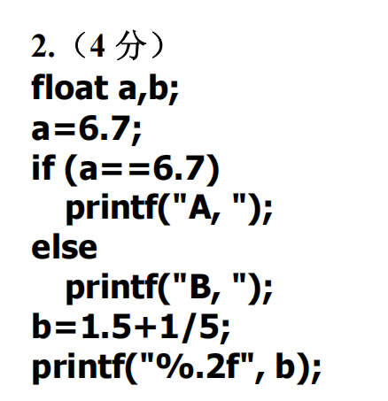

**C语言学习的问题是借助ai或自己想出来题解后没有及时总结，导致遗忘，所以在这里总结所有C语言的往年期中题与OJ过程中遇到的问题**
**主要误区在于认为刷题量足够就能掌握，但实际上没有记住**

##### 2010

1.1
int i = 20;
printf("%d,%o,%x,%u",i,i,i,i);

---20，24，14，20---十进制，八进制，十六进制，正十进制（-2的31次方~2的31次方-1（因为有0））（剩下三个数都是0~2的32次方-1）
【char-1字节；short int-2字节；int/long int（或8字节）-4字节；float-4字节；double-8字节；long long-8字节；long double-16字节】（unsigned不影响字节）

---方法sizeof（）
可以用sizeof计算数组长度a[];len = sizeof(a) / sizeof(a[0])

单位关系：
位（bit）---2进制中的一位数
字节（byte）---8位2进制数---一个字节可以表示256种状态，0~255
（1KB = 1024byte；1MB = 1024KB等等）

总结所有数据类型与%：
%d   ---int
%i   ---int(输出十进制有符号整数（同%d），但支持八进制，十六进制输入)
%u   ---unsigned int
%o   ---unsigned int(八进制，十六进制都无符号，也就是说只有整数)---%#o带前缀
%x(/%X)   ---unsigned int---%#x带前缀
%f   ---float
%lf  ---double
%e/%E   ---科学计数法输出**浮点数**
%g/%G   ---选用科学计数法或小数（哪个短选哪个）输出**浮点数**
%c   ---char字符（单个）
%s   ---char*字符串指针，字符串
%p   ---十六进制输出指针地址

%zu  ---size_t类型（表示数组长度，内存长度等）
%zd  ---size_t有符号版zu

%hd  ---short int
%hu  ---short unsigned int
%ld  ---long int
%lu  ---long unsigned int
%lld ---long long int
%llu ---long long unsigned int

**表示范围：总范围为2的位数次方。比如int，4字节，4*8 == 32位，总数是2的32次方个数**

1.2
int i = 0,j = 1,k = 2;
if ((++i || ++j) && k++)
printf("%d,%d,%d",i,j,k);

++i ==1---此时or找到真，短路，j不加，保持1，k目前是2，先进行and操作，然后k加为3，
输出：1，1，3

1.3
int n = 0,m = 1,x = 2;
if (!n) x -= 1;
if (m) x -= 2;
if (x) x -= 3;
printf("%d",x);

除了0，哪怕负数也都是真，所以2 - 1 - 2 - 3 == -4

1.4
int x = 1,y = 2,z = 3;
do
{
    switch(y++)
    {
        case 1: x++;break;
        case 3: x += 3;break;
        default:x = x % 2;continue;
    }
    z++;
}while(y < 5)
printf("%d,%d,%d",x,y,z);

依旧先Switch，后y+1,y = 3
那么先进入default，x = 1，continue跳过z++
先Switch，进入case3，然后y = 4
x = 4，break跳出Switch，z++ = 4
下一步y = 5，进入default，x = 0
0，5,4

1.5
char ch1,ch2;
int n1,n2;
ch1 = getchar();
ch2 = getchar();
n1 = ch1 - '0';
n2 = n1 * 100 + (ch2 - '0');
printf("%d",n2);

主要：char - '0'可以把一个字符数字变为int数字
100 + 2 = 102

1.6
char a[20] = "abc\b\0x56\078\\0"
【分区：a,b,c,\b,\0x56,\07(因为8进制没有8),8,\\0(表示‘\0’)】
printf("%d\n",strlen(a));
【长度是5:a,b,c,\b,\0】
strcpy(a"xmu");
【把xmu复制到a中，覆盖原内容，且自动添加\0----->xmu\0】
printf("%d\n",a);
strcat(a"90");
【strcat在\0处拼接90---->xmu90】
printf("%s\n",a);
printf("%d",strcmp("a",a) < 0)
【strcmp比较两个字符的ASCII码，从第一位开始找不同，第一位a-97，x-120，；strcmp返回97 - 120 == -23 < 0为真，所以最终返回1】

EOF---end of file文件结束，代码中-1表示（Windows可以用Ctrl+z触发EOF）
\0---字符串结束符，ASCII码为0，\n的ASCII码为10
scanf读入%s：读到空白符（空格，\t,\n,\r回车,\f换页,\v垂直制表）时停止读取（也就是不读取空白符---留在缓冲区），然后自动在末尾添加\0

1.7
void ss(char s[],char t,int n)
{
    int i = 0;
    while (s[i] && i < n)
    {
        if (s[i] == t) s[i] = t - 'a' + 'A';[最简单的字符小写转大写写法，不必记住ASCII]【char类型的加减运算：先都变成ASCII的整数，然后运算，然后变为ASCII的值】
        i++;
    }
}
int main(void)
{
    char str1[20] = 'adcdedgdid';
    ss(str1,'d',6);
    printf("%s",str1);
}

1.8
int test(int n)---判断回文数（d = （（10 * 个位） + 十位） * 10 + 百位（三位数为例））
{
    int d = 0,m = n;
    while (m)
    {
        d = d * 10 + m % 10;
        m /= 10;
    }
    return (d == n);
}

int main(void)
{
    int i;
    int data[] = {5,123,121};
    for (i = 0;i < 3;i++)
    printf("%d %s\n",data[i],test(data[i] ? "OK":"NO"));

    return 0;
}

1.9
void sub(int p[],int k,int n)
{
    int a,b,t;
    a = k - 1;
    b = n + 1;
    while (++a < --b)
    {
        t = p[a];
        p[a] = p[b];
        p[b] = t;
    }
}

int main(void)
{
    int k,s[12] = {0,5,10,15,20,25,30,35,40,45,50,55};
    sub(s,1,3);
    for (k = 0;k < 6;k++)
    {
        printf("%d ",s[k]);
    }
    printf("\n");
    sub(s+6,0,3);---调用数组切片后6个
    for (k = 6;k < 12;k++)
    {
        printf("%d",s[k]);
    }

    return 0;
}
[函数中也能改变外部数组]

1.10
void swap1(int c[])
{
    int t;
    t = c[0];
    c[0] = c[1];
    c[1] = t;
}

void swap2(int c0,int c1)
{
    int t;
    t = c0;
    c0 = c1;
    c1 = t;

}

void main()
{
    int a[2] = {3,5},b[2] = {3,5};
    swap1(a);
    swap2(b[0],b[1]);
    printf("%d%d%d%d",a[0],a[1],b[0],b[1]);
}

【传数组地址才能改变数组，单纯传值不会改变数组本身】

1.11
int f(int b[][4])
{
    int i,j,s = 0;
    for (j = 0;j < 4;j++)
    {
        i = j;
        if (i > 2) i = 3 - j;
        s += b[i][j];
    }

    return s;
}

void main()
{
    int a[4][4] = {{1,2,3,4},{0,2,4,5},{3,6,9,12},{3,2,1,0}};
    printf("%d",f(a));
      
}

1.12
void f(int i,int j)
{
    if (i < j)
    {
        printf("%d",i);
        f(i + 1,j - 1);
        printf("%d",j);
    }
}

void main()
{
    f(0,4);
}

2.1
1.&
2.&& ||
3.2x--->2 * x

4.函数调用数组，主函数只写数组名（也就是地址）
5.二维数组的顺序
6.分号等符号

7.cnt赋初始值
8.#define语句后不需要加分号
9.循环范围问题

gets函数：
从标准输入中读取一整行字符串，直到遇到换行符\n，把\n替换为\0
缺陷：没有长度限制，可能会溢出
用法：
char str[10];
gets(str);

fget函数：
从指定输入流（如stdin标准输入流）读取字符串，最多读取n - 1个字符（n是指定缓冲区大小，遇到\n或字符限制时停止，并把\n保留在字符串中
用法：
char str[10];
fgets(str,10,stdin);最多读9个字符，最后一个是\0,而\n也被算在前九个字符中
str[strcspn(str,"\n")] = '\0';

strcspn，后一个参数可以是一个字符串，strcspn会返回这个字符串第一个元素在前一个数组中的索引

##### 2023
1.1
int x,y,z,w;
x = (y = 8,z = 16,w = 32);---逗号表达式的结果是最后一个子表达式的值，所以x = 32
y = !z || w > z > y;---!z = 0，不短路，w > z = 1,1 > y = 0---y = 0
z = x == w;---x == w = 1,z = 1
w += w /= w + 1; w = w / w + 1 = 0,w += 0 == 0
printf("%d %d %d %d",x,y,z,w);

1.2
double d = 19.5;
int i = (int)d % 7,j = 33;---强制转换没有副作用，也就是说d还是19.5
printf("%lf,%i\n",d,i);
printf("%X,%c\n",j,'a' + j / 8);
【%必须是整数运算，19%14 = 5 = i；%f，%lf都是默认输出6位小数】

1.3
int x = 0x202311;
printf("%d\n",(char)x);
char a = -128,b = 'x' - 'Z';a--;
printf("%d %d",a,b + 127);

【十六进制两位一字节，而char只有一字节，所以我们截取x的最右一字节也就是0x11，在10进制中是17；十进制x = 202311；char（x） = 202311 / 256 = 790余151，所以返回151；仔细想想为什么16进制正好是两位，就是因为16进制两位能表示16的平方个数也就是256个数恰好是一字节】
【'A'的ASCII为65；'a'的ASCII为97；大小写相差32，x - Z也就是x - X - 2 = 32 - 2 = 30】
【别忘了，char范围是-128~127，-128 - 1 == 127】

1.4
int a = 1,b = 3,c = 5,d = 4,x;
if (a < b)
  if (c < d && ++a) x = 1;
else if (a < c || b--)
  if (b < d && c++) x = 2;
else x = 3;
  else x = 6;
    else x = 7;
printf("%d %d %d %d,x,a,b,c);

初步理解：
if (a < b)
{
    if (c < d && ++a) x = 1;
    else if (a < c || b--)
        if (b < d && c++) x = 2;
        else x = 3;
    else x = 6;
}
else x = 7;

整理后很容易看出结果

1.5
int i;
for (i = 1;;i += 2)
{
    if (!(++i % 2))
    {
        printf("%d",i);
        continue;
    }
    if (++i % 3 == 0) break;
}
printf("%d",i);

1.6
int p[7] = {5,9,12,23,30},i = 0,k = 0;
while (p[i]++ % 2)
{
    printf("%d ",p[i]);
    switch(p[i + 3] % 5)
    {
        default:i++;continue;
        case 3: k+= 3;
        case 1: k += p[++i];break;
    }
}
printf("%d %d",i,k);

1.7
double t = 0.5;
do
{
    printf("%.2lf\n",t > 0 ? 10 : 8.63);
    t *= -.1e - 2;
}
while (fabs(t) > 1e-6);
  
【fabs（），计算绝对值（double输入）】
科学计数法的用法：
aeb表示a * 10 ^ b
a是数字部分，可以包含小数，但b只能是整数，a\b都可正可负
不论整数还是小数，都是double类型

1.8
#define N 7
int i,j,temp,a[N];
for (i = 0;i < N;i++)
{
    scanf("%d",&a[i]);
}
for (i = 0;i < N / 2;i++)
{
    j = N - 1 - i;
    temp = a[i];
    a[i] = a[j];
    a[j] = temp;

}
for (i = 0;i < N ;i++)
{
    printf("%d",a[i]);
}

1.9
char s[] = "wi\n\x86\0CPU";
char a[] = "RTX4070i",b[] = "Radeon R7";
printf("%d\t%d\n",strlen(s),strcmp(a,b) > 0);
strncpy(a,b,7);
puts(a);
puts(b);

总结字符串操作：
1.strlen(str)，不包含\0，但是\n等会算上
2.strcpy(a,b)把b复制到a里，包括\0
3.strncpy(a,b,5)把b的前n个字符复制到a中，但是需要给a手动补上\0(不过没有复制到的地方保持a原有字符)
4.strcat(a,b)把b拼接到a后面（覆盖掉a的原有\0，在新字符串末尾自动添加\0）
5.strncat,同3.4.
6.strcmp(a,b)逐个比较元素ASCII码值，不一样返回整数a - b
7.strncmp同上

总结输入输出：
+ 单个字符
  - char ch = getchar();
  - putchar('A');putchar('\n');
  - scanf("%c",&a[i]);---如果是%c，前加空格可以跳过\n，%d等不会读入，留在缓冲区
  - printf("%c",ch);
+ 字符串
  - scanf("%s",str);遇到空格，制表符，换行符终止（不读入这些换行等东西，直接在这里加\0），自动加\0
  - printf("%s",str);
  - fgets(str,size,stdin);
  - fputs(str,stdout);
  - gets(str)---遇到\n为止，并自动把\n换为\0

1.10
char s[][10] = {"1234","56789"};
int i,j,sum[2] = {0};
for (i = 1,j = 0;j < 2;j++,i = j)
{
    for (; s[j][i];i *= 2)
    {
        sum[j] = 10 * sum[j] + s[j][i] - '0';
    }
    printf("%d %d\n",sum[j],i);
}

##### 其他年份串烧

小数默认储存double形式，而float和double的小数虽然看上去相同，但有微小差异，所以转入else
最终：B,1.50

